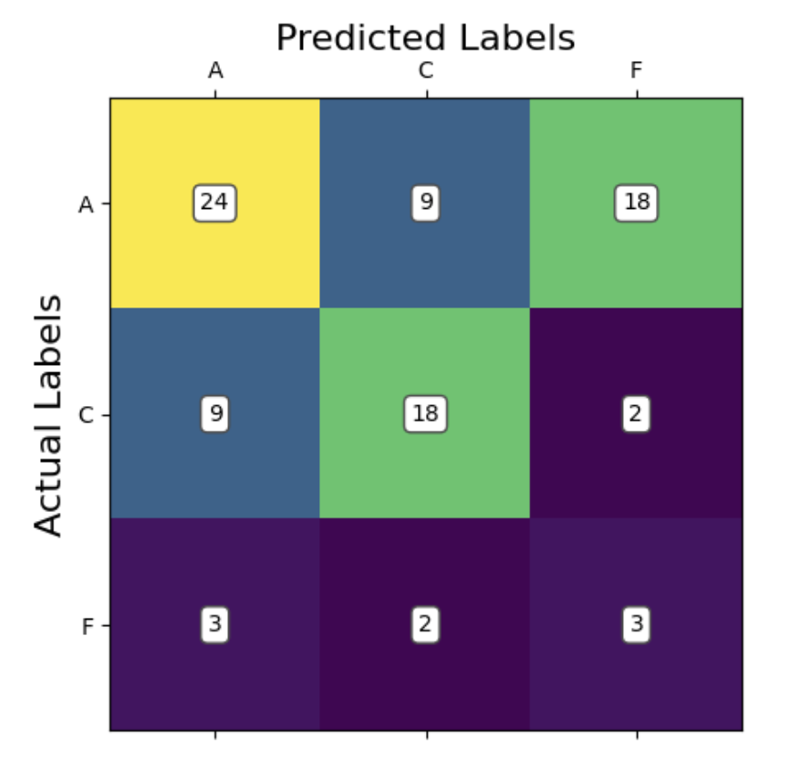
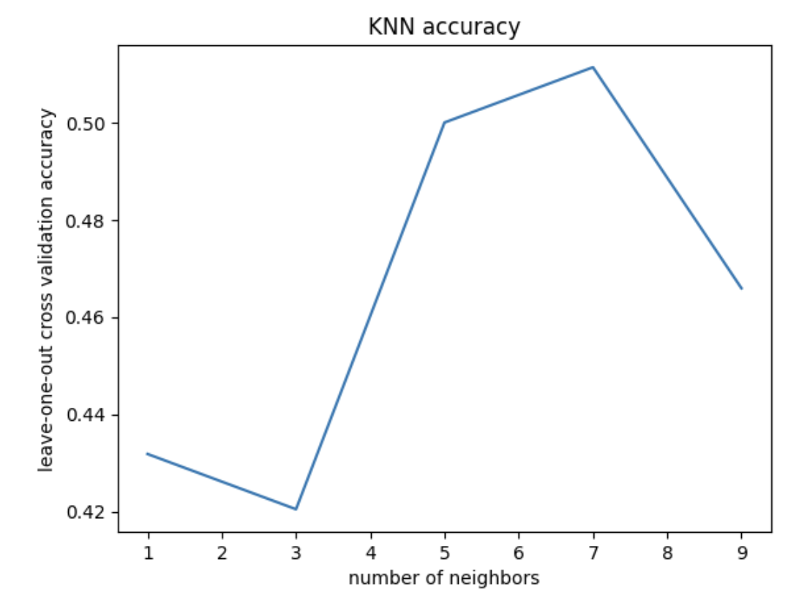
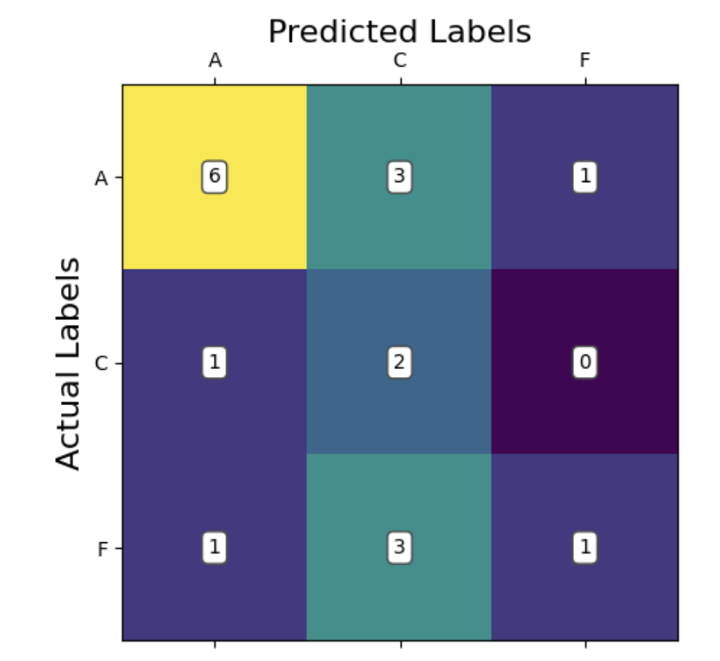
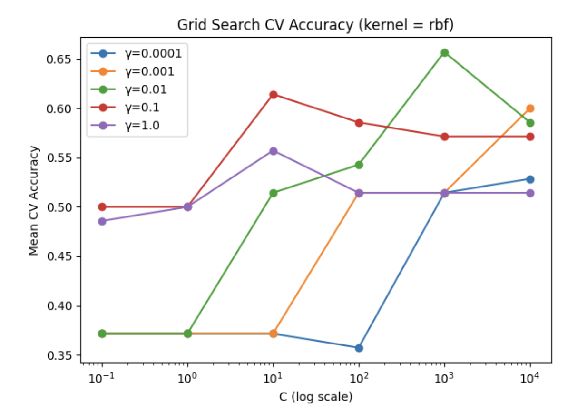
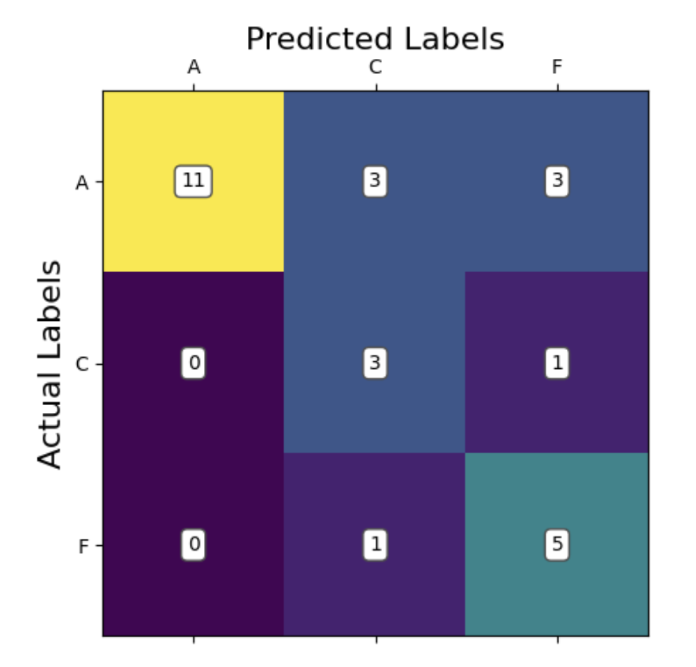

In accordance with Georgia Tech and CS 4641 academic integrity guidelines, this page is a copy from its original repository outside of GitHub Enterprise and without source code.
# Final Report

## Introduction/Background
Alzheimer’s disease is a neurodegenerative disorder characterized by memory loss, inability to perform simple tasks, and death. Its treatments only slow the progression of the disease. The best outcome for a patient happens when the disease is identified early, meaning that tools to diagnose Alzheimer’s disease early on are useful to help patients.

Machine learning has been shown to be a promising tool to diagnose Alzheimer’s disease. Previous studies have used a variety of techniques, ranging from data augmentation [4] to contrastive representation [5] to predict the prognosis of Alzheimers.

The dataset used for this project is a set of EEG recordings from 88 participants, 36 with Alzheimer’s, 23 with frontotemporal dementia, and 29 healthy controls.

[Dataset Link: https://openneuro.org/datasets/ds004504/versions/1.0.8](https://openneuro.org/datasets/ds004504/versions/1.0.8) [1]

## Problem Statement
Problem: Diagnosing Alzheimer's early is difficult, but is a necessary step in effectively treating the disease. Machine learning could help create early detection models.

Motivation: 1 in 9 adults over the age of 65 were living with Alzheimer's disease in 2023 [6]. This number will only grow until effective breakthroughs are made in medical treatment, and that begins with effective early detection. Early treatment is necessary to stop the spread of the neurodegeneration before it gets too bad. This requires a high-accuracy diagnostic tool, and current models using EEG data only reach an F1 score of ~86% [5]; greater accuracy is needed for utility in the medical environment. 

## Methods
### Preprocessing
To preprocess the raw EEG voltage data, we will employ:
1. **Feature Extraction**: We took the raw EEG channel data from each subject and extracted the following information from each electrode; \[max, min, mean, variance, signal energy, relative delta band power, relative theta band power, relative alpha band power, relative beta band power, relative gamma band power\]. This gives 10 features per electrode, and there are 19 electrodes per subject, so each subject outputs a feature vector of shape (1, 190).
   
2. **Standardization**: Because certain features were orders of magnitude higher in variance than others, we standardized features according to the formula (X - mean) / st.dev.
   
3. **Forward Feature Selection**: In order to reduce the dimensionality of the feature space before training, forward feature selection was run using an OLS predictor. This produced the following features when significance was set to .2; \['e5\_max', 'e17\_relThetaPower', 'e18\_relThetaPower', 'e1\_relBetaPower', 'e4\_relBetaPower', 'e14\_min', 'e14\_max', 'e8\_relThetaPower', 'e11\_relThetaPower', 'e6\_mean' \]. Note that the eXX_ prefix denotes which electrode the feature came from. The band powers are defined by a frquency range for the voltages.

### ML Algorithms/Models
We have implemented the following supervised learning methods using the preprocessed data from above. 

1. **k-Nearest Neighbor (kNN)**: We saw through our background research that kNN algorithms are routinely used in the classification of EEG data [7]. As a classifier which can handle data regardless of linear separabolity, kNN algorithms are sufficiently versatile to help us gain a broad under understand how learnable our data is. It provided relatively quick and easily-understandable results to help guide our implementations of future models.
2. **Support Vector Machine (SVM)**: Given our results from the kNN algorithm, we knew the data was learnable. In the literature, it is common to see decreased spectral power in higher frequency bands and increased power in lower bands within cognitively impaired individuals. We also discovered studies which achieved highly accurate EEG signal classification with SVM models [2]. Therefore, we decided to implement SVM as a way to see if the data was linearly separable such that SVM would outperform kNN.
3. **Multilayer perceptron**: We established that our data is learnable; however, we wanted to apply a more sophisticated model for capturing non-linear trends in the event that out data as not linearly separable. Therefore, we implemented a multilayer perceptron. We selected MLP rather than other methods such as CNNs or RNNs in order to minimize overfitting on our small dataset. This serves as a useful point of comparison against the SVM and gives us insight into the nature of how our data is learnable (whether it is learnable due to linear separability, or if it is necessary to use more complex decision criteria).
   
## Results/Discussion

We will analyze our models' performance by examining their confusion matrices and their predictive accuracy. Since this is a ternary classification problem, confusion matrices will help us understand where the model struggles, especially in distinguishing between Alzheimer’s and Frontotemporal Dementia. Predictive accuracy will provide a general measure of how often the model makes correct classifications. We also provide some useful visualizations regarding our hyperparameter tuning results for kNN and SVM, showing validation accuracies with different parameter combinations.

### k-Nearest Neighbors

### Support Vector Machine

### Multi Layer Perceptron

## Analysis
### kNN:
  Given our small sample size, our predictive accuracy is not terrible. It is not incredibly accurate, however, it is above chance. This means that there is likely learnable information here; we just need to continue optimizing our models. Taking a look at our cross-validation result for different k values, we see the highest accuracy at k = 7 neighbors (acc = 0.51). This tells us that 7 neighbors is the best for accurate classification using kNN, but actually the graph tells us more importantly that kNN may not be a good model choice for this classification problem. We would normally expect to see some overfitting with 1-2 neighbors, but we don't really see that in our case, with the training loss never descending rapidly, ie, overfitting.
  
  Looking at our confusion matrix, we can see that the model performed significantly better at accurately predicting the Alzheimer's (A) and control (C) groups compared to the fronto-temporal dementia group (F). This is potentially due to there being a high similarity between the Alzheimer's and dementia groups. In most cases, we can see that the model preferred did not consider predicting dementia at all. This is evidenced by there being more false negatives predicting dementia when the true label is Alzheimer's than there were total predictions of dementia at all. The model has learned that if it sees an irregular pattern, it is likely someone with a cognitive impairment, and there are more Alzheimer's patients in the data than dementia patients. So, it has learned to predict Alzheimer's most of the time for higher accuracy. In fact, if you binarize this classification to control vs disease (combining Alzheimer's and dementia), the model classifies correctly 66/88 times (acc = 0.75). This is in line with our predictions from the proposal, where we thought the model would be able to distinguish between healthy and cognitively impaired individuals but struggle to distinguish between Alzheimer's and dementia patients.

### Support Vector Machine
   The accuracy we observed is somewhat surprisingly low compared to our expectations. The model did predict above chance with an average accuracy of 50%, however this did not outperform kNN despite being a more sophisticated model. We take this to mean that the data is not linearly separable even using the kernel trick, at least with the 4 kernels we tried (rbf, polynomial, sigmoid, linear). Our model hyperparameters were optimized using gridsearch allowing us to lock in the parameters \[C = 1000, gamma = 0.01, kernel = radial basis function\]. This granted a cross validation accuracy of 65.7%, however on our test data we observed the poorer accuracy of 50%. 

   In our confusion matrix for SVM, we can see that the model appears to be able to recognize Alzheimer's patients somewhat reliably. In comparison, the model is misclassifying between frontotemporal dementia and cognitively normal patients quite often. This suggests that perhaps the best decision boundary the model can come up with is one which isolates between Alzheimer's and everything else. This would suggest that the data is rather difficult to linearly separate. Also of note, our data contains a larger number of Alzheimer's patients compared to the other groups. This kind of bias has been known to skew model learning towards classification of that class, as it is more likely to be correct in the average case. This could also help explain some of what we are seeing.

   Compared to kNN, we fail to find a significant advantage of SVM over kNN. The normal advantage of SVM would be that it can define an interpretable decision boundary, however our model failed to converge in a meaningful way. There are also more hyperparameters to consider with SVM over kNN. On the other hand, an advantage of SVM is that we still retain the capability to further optimize this model by engineering new features. kNN could also take in these features, but cannot transform them using the kernel trick like SVM could. Therefore, there may exist a yet undiscovered feature which SVM could perform very well with.

### Multi-layer Perceptron 
   We employed a Multilayer Perceptron (MLP) with three hidden layers using SELU activation, batch normalization, dropout regularization, and L2 weight penalties. The model was compiled with the Adam optimizer and trained using categorical cross-entropy loss to classify subjects into one of three neurological conditions based on 190 pre-extracted features. We switched from using CNN model since the accuracy was around 60%.

   The multilayer perceptron boasts a higher accuracy of  70.37% with a kfold validation average accuracy of 54.51%. The Prediction of Alzheimer's seems to be the biggest place for improvement as it only guessed correctly 64.7%. Having said that, it is the one with the most labels when compared to the other categories. Regardless, the MLP is the first model we have which is predicting the majority of classes correctly within the scope of the true labels. That is, the max values for each row of the confusion matrix is the main diagonal. Moving forward the addtion of additional data will yield more reliable results as we are currently limited with what we have.

   Compared to our kNN and SVM, the obvious advantage of MLP is that it is predicting more accurately. Rather than relying on the kernel trick, the network is able to create its own transformations through adjusting parameter weights to capture non-linear complex trends. The downside of this is that the model is less interpretable, and something of a black box with respect to how it is making its decisions. There are also even more hyperparameters to consider which makes training more cumbersome and computationally expensive. 

## Next steps
1. Our MLP performed well, however we believe all of our models could perform better given more data. To that end, we would consider using shorter windows of data rather than the full time series to extract features. This would allow us to get more data points per subject and could help learning and classification. In addition, simply gathering more training data from diverse popultations would help.
2. Exploring the literature to find new features to extract may assist models, especially the SVM. Our models are inherently limited by the quality of features we choose to implement. This could be part of why a neural network which makes its own features performed so noticably better. Exploring new features may allow models like SVM to perform better.
3. Given the success of our non-linear classifying MLP, we would consider implementing additional models known to capture non-linear trends. Things like convolutional neural networks or random forests could be good candidates to this end.
4. We recognize that our method of feature extraction effectively flattened the time series characteristic of our EEG data. In the future, exploring models which are more robust for waveform analysis and classification, sich as LSTM, could provide new insight into our data and potentially improve our accuracy.

## References
[1] A. Miltiadous et al., “A Dataset of Scalp EEG Recordings of Alzheimer’s Disease, Frontotemporal Dementia and Healthy Subjects from Routine EEG,” _Data_, vol. 8, no. 6, p. 95, May 2023. doi:10.3390/data8060095 

[2] D. Pirrone, E. Weitschek, P. Di Paolo, S. De Salvo, and M. C. De Cola, “EEG Signal Processing and Supervised Machine Learning to Early Diagnose Alzheimer’s Disease,” _Applied Sciences_, vol. 12, no. 11, p. 5413, May 2022. doi:10.3390/app12115413

[3] A. Gramfort, M. Luessi, E. Larson, and D. Engemann, “MEG and EEG Data Analysis with MNE-Python,” _Frontiers in Neuroscience_, vol. 7, Dec. 2013. doi:10.3389/fnins.2013.00267 

[4] R. Aarthi, V. Maadhesh, P. Rajalakshmi, and S. J. Thomas, “Alzheimer’s Disease Prediction using Machine Learning techniques with the help of Electroencephalogram Brain Signal,” 2024 15th International Conference on Computing Communication and Networking Technologies (ICCCNT). IEEE, pp. 1–6, Jun. 24, 2024. doi: 10.1109/icccnt61001.2024.10725703 

[5] X. Zhang, Y. Wang, P. Chandak, and Z. He, “Deep Learning for EEG‐Based Alzheimer’s Disease Diagnosis,” Alzheimer’s & Dementia, vol. 19, no. S15. Wiley, Dec. 2023. doi: 10.1002/alz.071575 

[6] Alzheimer's Association Report "2023 Alzheimer's disease facts and figures" Alzheimer's & Dementia, vol. 19, no S4. Wiley, Apr. 2023. doi.org/10.1002/alz.13016

[7] N. Isa, A. Amir, M.Z. Ilyas, and M.S. Razalli, "The Performance Analysis of K-Nearest Neighbors (K-NN) Algorithm for Motor Imagery Classification Based on EEG Signal," MATEC Web Conf., vol 140. 2017 International Conference on Emerging Electronic Solutions for IoT (ICEESI 2017). Dec. 2017. doi:10.1051/matecconf/201714001024

## Contribution Table

| Name                   | Contributions    |
|:-----------------------|:----------------------------------|
| Jason Miller           | Feature extraction, feature standardization, feature selection, website templating, hyperparameter cross validation|
| Jennifer Fenton        | Template to open dataset in Colab, kNN, cross-validation
| Arnav Gonella          | Multilayer perceptron optimization, K-fold cross-validation
| Hector Mur Lopez       | CNN, SVM, Report, Cross-Validation
| Ishan Doma             | CNN initial test, multilayer perceptron w/ selected features, data normalization

###

